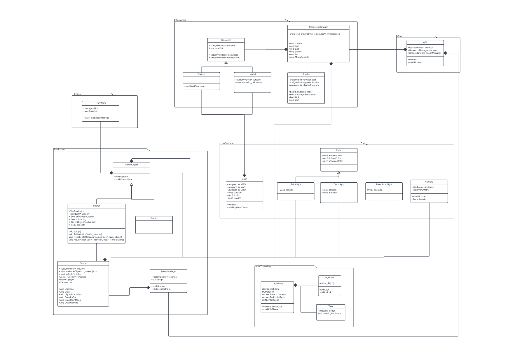

# Multithreading ResourceManager
This project is based on the platformer project made in first year. The goal is to load the resources asynchronously from the main code.

# Multithreading
When you launch the program, you have to choose the mode you want the program to be launched on :
- MonoThread  : Everything is loaded on the main thread,
- MultiThread : Each resource is loaded on a thread which is destroyed right after the load,
- ThreadPool  : Each resource is loaded on a thread that is used again after the load thanks to the ThreadPool,

! Be carefull !  You have to choose it in the consol !

# Controls

## Camera
The camera turn around the player.
- Left arrow   : turn left,
- Right arrow  : turn right,
- Up arrow     : camera goes up,
- Bottom arrow : camera goes down.

## Player
The player walks in the camera direction
- W : Forward,
- S : Behind,
- A : Left,
- D : Right.

## Other
- U : Reload the scene,

